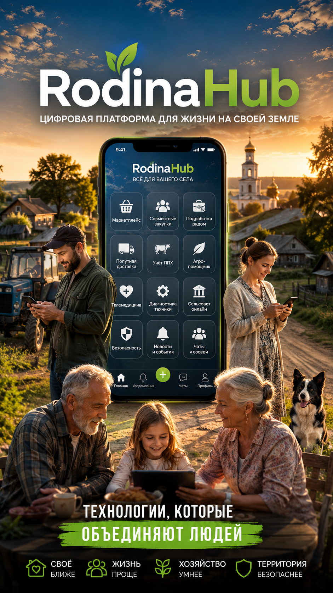

# RodinaHub



**RodinaHub** — цифровая инфраструктурная платформа для деревень, посёлков, малых городов, СНТ и локальных сообществ.

RodinaHub — платформа для жизни, работы и развития территорий. Цифровая экосистема для жизни на своей земле.

Платформа объединяет в одной экосистеме сервисы для жителей, фермеров, бизнеса и местной администрации.

Наша цель — создать **операционную систему малой России**.

---

# Миссия

Упростить жизнь, работу, торговлю, управление и развитие территорий через цифровые инструменты.

RodinaHub помогает:

- жителям быстрее находить товары и услуги
- фермерам вести хозяйство
- местному бизнесу находить клиентов
- администрации управлять территорией
- сообществам объединяться и развиваться

---

# Проблема

В России более 100 000 деревень и сельских населённых пунктов.

Большая часть процессов там до сих пор работает хаотично:

- через Telegram-чаты :contentReference[oaicite:0]{index=0}
- по телефону
- через бумажные записи
- через знакомых
- без прозрачной логистики
- без локальных цифровых сервисов

Из-за этого возникают проблемы:

- сложно продать или купить что-то рядом
- дорогая доставка
- трудно найти подработку
- нет удобного взаимодействия с администрацией
- нет учёта хозяйства
- слабый доступ к медицине
- нет цифровой кооперации

RodinaHub решает эти задачи.

---

# Что входит в платформу

# B2C — для жителей

## Локальный маркетплейс

Покупка, продажа и аренда внутри населённого пункта.

Категории:

- продукты
- животные
- техника
- стройматериалы
- инструменты
- услуги

Примеры:

- продать молоко
- купить дрова
- арендовать трактор
- найти сварщика

---

## Совместные закупки

Объединение заказов для снижения стоимости доставки.

Подходит для:

- семян
- удобрений
- кормов
- бытовых товаров
- стройматериалов

Преимущества:

- дешевле
- быстрее
- выгоднее

---

## Локальная подработка

Поиск работников рядом.

Форматы:

- сезонные работы
- стройка
- уборка
- покос
- перевозки
- ремонт

Главная идея:

**"нужен человек сегодня"**

---

## Попутная доставка

Логистика между деревней, райцентром и городом.

Сценарии:

- привезти лекарства
- забрать заказ
- отвезти документы
- доставить посылку

Модель:

люди помогают людям.

---

---

# B2B — для бизнеса и фермеров

## Учёт ЛПХ

Цифровой учёт хозяйства:

- животные
- кормление
- расходы
- вакцинация
- доходы
- прибыль

Замена бумажных тетрадей.

---

## Управление техникой

Учёт:

- тракторов
- мотоблоков
- генераторов
- насосов

Функции:

- история ремонтов
- обслуживание
- диагностика
- напоминания

---

## Кооперативная торговля

Инструменты для:

- складов
- закупок
- оптовых продаж
- логистики
- распределения заказов

---

# B2G — для администрации

## Цифровой сельсовет

Единое окно для обращений.

Функции:

- заявки
- жалобы
- голосования
- объявления
- новости
- опросы

Примеры:

- ремонт дороги
- освещение
- вывоз мусора
- очистка снега

---

## Безопасность территории

Мониторинг:

- камеры
- пожары
- отключения электричества
- подозрительная активность
- экстренные уведомления

---

## Мониторинг инфраструктуры

Контроль:

- вода
- электричество
- интернет
- дороги
- связь

---

# AI-модули

## AI-Агроном

Помогает:

- определять болезни растений по фото
- советовать сроки посадки
- прогнозировать урожай
- рассчитывать полив

---

## AI-Телемедицина

Удалённая помощь:

- консультации
- анализ симптомов
- повторные назначения
- интерпретация анализов

---

## AI-Диагностика техники

Анализ по:

- фото
- видео
- звуку

Определение:

- износа
- поломок
- утечек
- перегрева

---

# Архитектура

Платформа строится по микросервисной архитектуре.

## Frontend

- Next.js
- React
- PWA
- Mobile-first UI

## Backend

- ASP.NET Core
- PostgreSQL
- Redis
- RabbitMQ

## AI Stack

- Python
- YOLO
- Whisper
- LLM
- Computer Vision

## Infrastructure

- Docker
- Kubernetes
- Terraform
- S3 Storage

---

# Структура репозитория

```text
rodinahub/
 ├── rodinahub-web
 ├── rodinahub-mobile
 ├── rodinahub-admin
 ├── rodinahub-api-gateway
 ├── rodinahub-marketplace
 ├── rodinahub-jobs
 ├── rodinahub-delivery
 ├── rodinahub-groupbuy
 ├── rodinahub-farm
 ├── rodinahub-council
 ├── rodinahub-security
 ├── rodinahub-ai-agro
 ├── rodinahub-ai-health
 ├── rodinahub-ai-machinery
 ├── rodinahub-shared
 └── rodinahub-infra
```

---

# Бизнес-модель

## B2C

- подписка
- комиссии
- платное продвижение объявлений

## B2B

- SaaS для хозяйств
- аналитика
- управление закупками

## B2G

- лицензии для муниципалитетов
- региональные интеграции

## AI

- платная диагностика
- премиальные рекомендации
- AI-подписка

---

# Масштаб

Целевая аудитория:

- 100 000+ населённых пунктов
- миллионы домохозяйств
- фермеры
- местный бизнес
- муниципалитеты

RodinaHub можно масштабировать на:

- СНТ
- дачные посёлки
- агрокластеры
- малые города
- локальные кооперативы

---

# Видение

RodinaHub — это не просто приложение.

Это цифровой слой для локальной экономики, самоуправления, кооперации и развития территорий.

Платформа, которая объединяет людей, ресурсы и возможности там, где раньше всё работало вручную.

---

# Статус проекта

🚧 MVP в разработке.

---

# Слоган

**RodinaHub**  
**Жить. Работать. Развивать своё.**

Я сейчас собираю вокруг RodinaHub людей, кому близка тема системных проектов в ИТ/бизнесе.
У меня за плечами опыт построения большой ритейл-сети Магнит, и сейчас пробую перенести этот опыт в новую среду:
https://github.com/AndreyLeonov80/RodinaHub
Если откликается — было бы интересно поговорить и обменяться взглядами.

Контакт: https://github.com/AndreyLeonov80/about
